# Accessibility Issues in Ad Driven Web Applications

---

**Abdul Haddi Amjad** , Muhammad Danish, Bless Jah, Muhammad Ali Gulzar IEEE International Conference on Software Engineering (ICSE) 2025

## Artifact Badge Request:

### 1. Available


### 2. Functional


### 3. Reusable

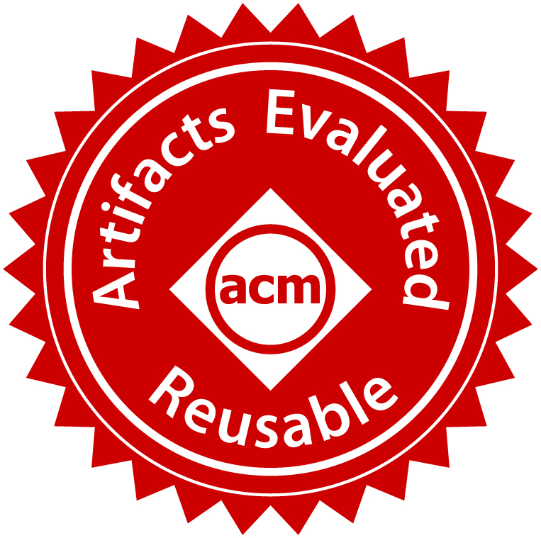

---

## Introduction

This paper, Accessibility Issues in Ad-Driven Web Applications, explores the impact of third-party advertisements on web accessibility. It identifies common accessibility violations introduced by ads, such as improper focus management and non-descriptive elements, and evaluates their compliance with WCAG guidelines. The study also provides actionable recommendations to improve accessibility in ad-driven web environments.

This is a public repository and zenodo link to download Virtual Machine (`.ova`) ([https://zenodo.org/records/14753704](https://zenodo.org/records/14753704)),and it includes everything—source code, dataset, and more — **available** to everyone.


---
## Installation

> **Ensure you follow the next steps on either a Mac (Intel) or Windows system.**
> **For any additional configurations or assistance, feel free to contact us at hadiamjad@vt.edu**

1. Install VM Ware Fusion using these steps: [https://services.tctc.edu/TDClient/323/InfoTech/KB/ArticleDet?ID=21304](https://services.tctc.edu/TDClient/323/InfoTech/KB/ArticleDet?ID=21304)
2. Install VM Machine (`.ova`) of from this link: [https://zenodo.org/records/14753704](https://zenodo.org/records/14753704)

### VM Machine Requirements

The downloadable size of the VM machine is approximately **10GB**.

**System Requirements:**
- **RAM:** 12GB
- **Hard Drive Space:** 15GB
- **CPU Cores:** 4
- **Supported Platforms:** macOS (Intel) or Windows

### What the VM Machine Includes:

- **Google Chrome**: Pre-installed for web browsing and testing.  
- **VS Code**: A fully configured code editor.  
- **Conda (`conda activate icse`)**: A preinstalled Python environment for seamlessly running code files and managing dependencies.  
- **Shell Script to Reuse Methodology (`run.sh`)**: Streamlines the application of our methodology.  
- **Shell Script to Reproduce Paper Results (`reproducible.sh`)**: Enables exact reproduction of the results presented in our paper.  

### If the VM Machine Prompts for a Code:

- **Code**: The code is **0000** (four zeros).  

> Note: If you choose to run from scratch, you can follow the steps in `src/README.md`, but it requires extensive configurations and will take significantly more time.
---
## Steps to Import/Open the VM Machine in VMware Fusion

1. **Download the VM Machine**:  
   Ensure you have downloaded the VM machine file (approximately 10GB) to your system.

2. **Open VMware Fusion**:  
   Launch the VMware Fusion application on your macOS (Intel) or Windows device.

3. **Import the VM Machine**:  
   - Open VMware Fusion and click `File` in the top-left corner.  
   - From the dropdown menu, select `Import` (mac) -- `Open` (Windows).  
   

4. **Choose the `.ova` File**:  
   - Click `Choose File` and browse to the location of the downloaded `.ova` file from the previous step.  
   

5. **Name and Save**:  
   - Assign a name to the virtual machine (e.g., `icse`) and click `Save`.  
   

6. **Wait for Import**:  
   - The virtual machine will start importing. This process may take a 5-10 minutes.  
   - **Note**: You don't have to configure resources but while importing if the system resources (RAM, CPU, Space etc.) are insufficient, you may encounter an error.  
   

7. **Complete Import**:  
   - Once the import is complete, click `OK` on the pop-up window and start the machine.  
   

8. **Enter the Code (if prompted)**:  
   - If prompted, enter `0000` (four zeros) as the code.  
   

9. **Open**: 
   - Open Google Chrome, search for `alaskanewssource.com` to check if it loads properly, and then CLOSE it.
   - Launch **VS Code** from the side dock.  
   - Open the folder located in `Downloads/icse`.  
   

10. **Activate the Conda Environment**:  
    - Open the terminal in VS Code and activate the Conda environment by running:  
      ```bash
      conda activate icse
      ```  
    

11. **Run the Shell Script to Reuse Methodology**:  
    - Execute the following command:  
      ```bash
      bash run.sh
      ```  
    - This step uses Selenium automation to perform the following operations, which will take approximately 5-7 minutes to complete:  
      - **Crawl the Website with Ads**: The script will crawl the website specified in `websites.txt` (e.g., `alaskanewssource.com`) with ads enabled.  
      - **Crawl the Website without Ads**: The script will then crawl the same website without ads.  
      - **Extract Ad-Specific Violations**: It will identify and extract accessibility violations introduced by ads. 
      > **Note:** If it crashes, delete the `output/alaskanewssource/` directory and re-run the `bash run.sh` command.
      

12. **View the Results**: 
    > **Note:** If it crashes, delete the `output/alaskanewssource/` directory and re-run the `bash run.sh` command. 
    - Once the script finishes running, you will see the following output in the terminal:  
        
    - This concludes the three-step methodology as outlined in the paper:
        1. **Crawling with Ads**: Results are saved in the folder `output/normal/`.  
        2. **Crawling without Ads**: Results are saved in the folder `output/adblock/`.  
        3. **Extracting Ad-Specific Violations**: The differences are saved in the `differences/` folder, containing `.csv` files that highlight ad-specific accessibility violations. The folder is also visible in the left panel for easy access.  

---
13. **Run the Shell Script to Reproduce Paper Results**: 

You can use the provided virtual machine to reproduce the results outlined in the paper. Follow these steps:

> **Note:** Due to the 30-minute artifact time limit, we use processed data to regenerate the tables and figures. If you prefer to generate them directly from the raw dataset, you can download and import the virtual machine (~22GB) [https://zenodo.org/records/14742897](https://zenodo.org/records/14742897). Please note that this process takes over 30 minutes to complete.

1. **Navigate to the Reproducible Directory**:  
   ```bash
   cd reproducible
   ```
2. **Run Shell Script**: 
   ```bash
   bash reproducible.sh
   ```
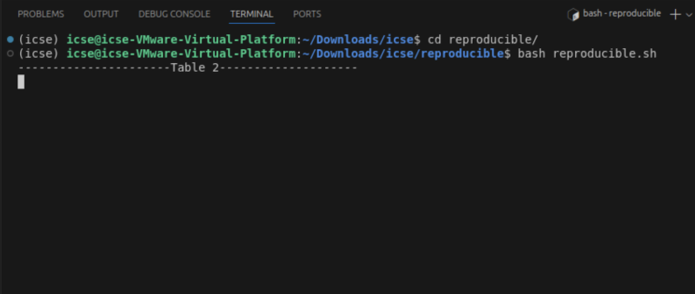

3. **Run Overview**: 
The script will generate the results in the following order:

##### Table 2:  

- **Time Required**: This step takes approximately 2-4 minutes to complete.  
- **Output**: The result is printed directly in the terminal.  

> The first two rows represent the aggregated totals of all data.  
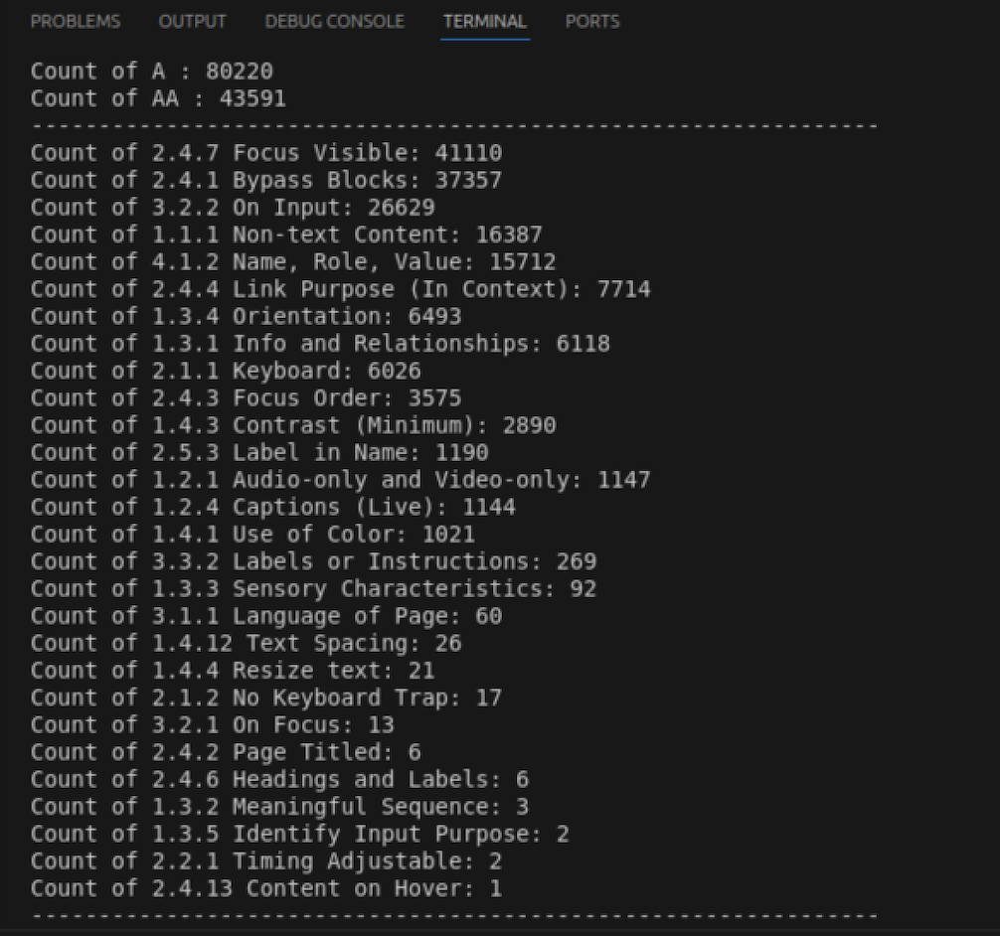
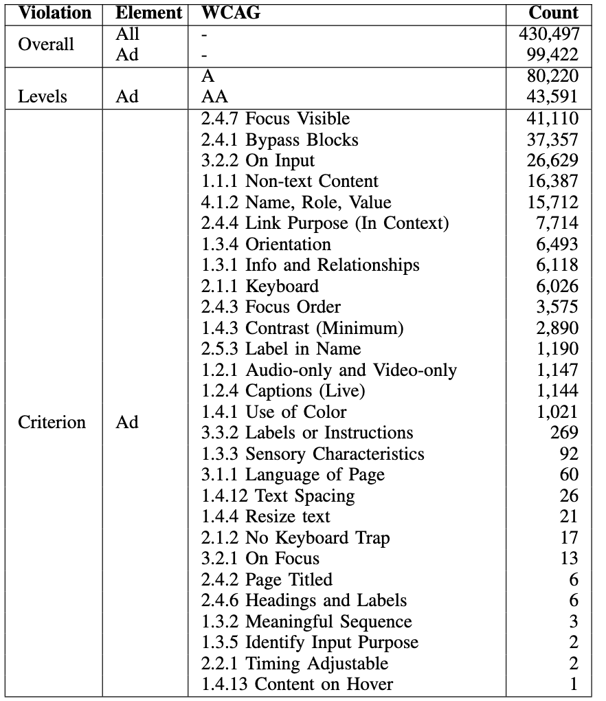

##### Table 3:

- **Time Required**: This step takes approximately 2-4 minutes to complete.  
- **Output**: The result is printed directly in the terminal.  

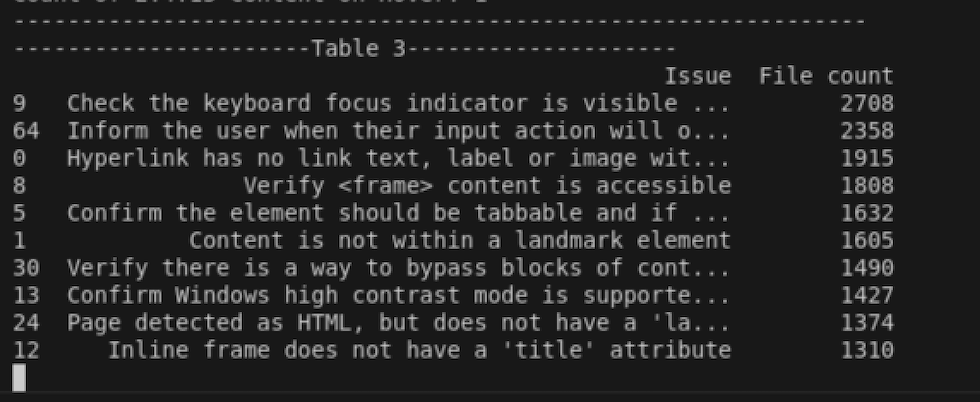
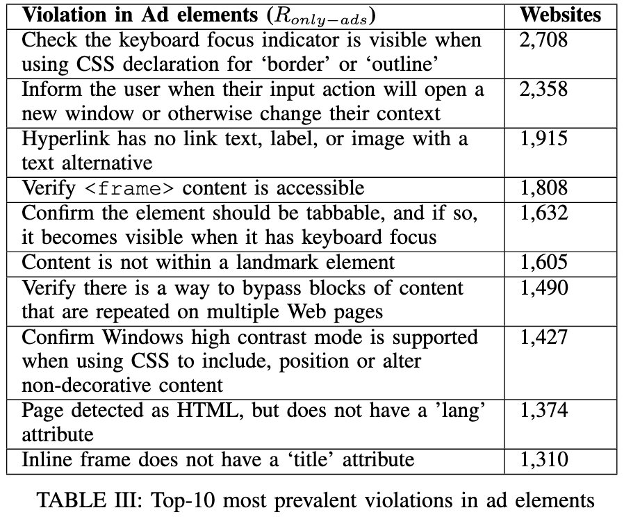

##### Table 4:

- **Time Required**: This step takes approximately 2-4 minutes to complete.  
- **Output**: The result is printed directly in the terminal.  

> You can scroll up and down to view all the top 5 entries.  

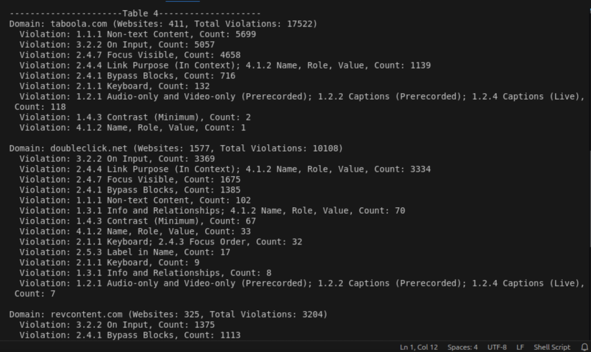
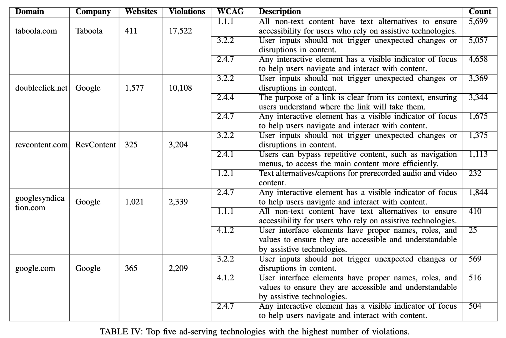

##### Figure 4:

- **Time Required**: This step takes approximately 5-10 minutes to complete.  
- **Output**: The figure will appear in a pop-up window once processing is complete.  

> You can close the figure to proceed to the next step.  

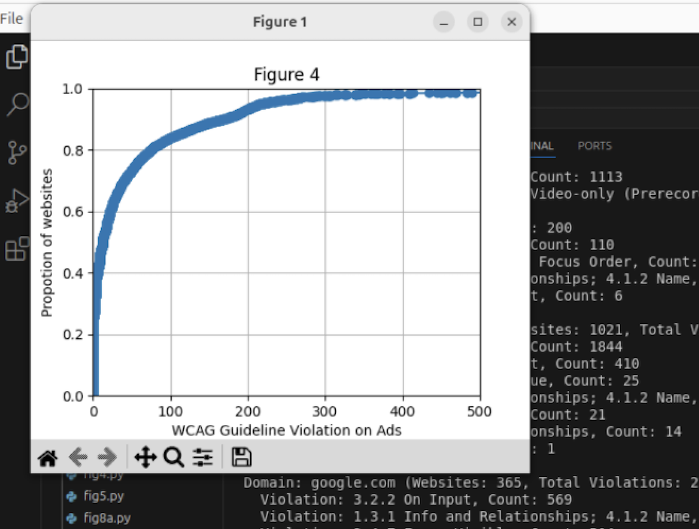
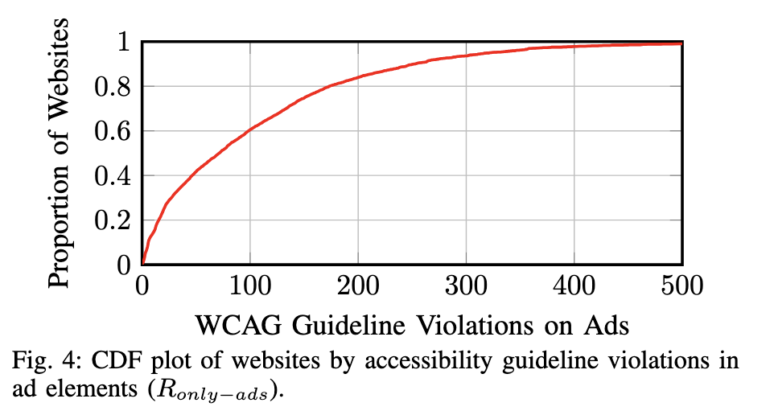

##### Figure 5:

- **Time Required**: This step takes approximately 2-4 minutes to complete.  
- **Output**: The figure will appear in a pop-up window once processing is complete.  

> You can close the figure to proceed to the next step. 

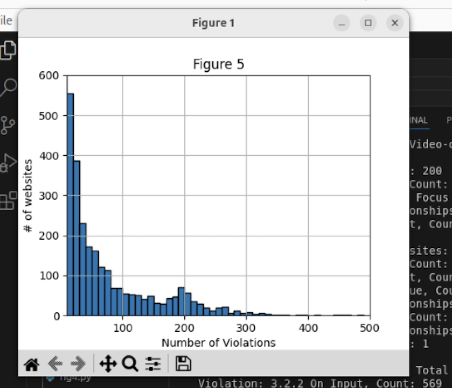
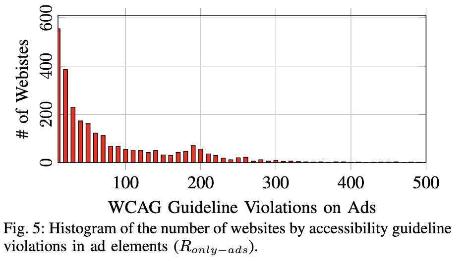

##### Figure 8a:

- **Time Required**: This step takes approximately 2-4 minutes to complete.  
- **Output**: The figure will appear in a pop-up window once processing is complete.  

> You can close the figure to proceed to the next step. 

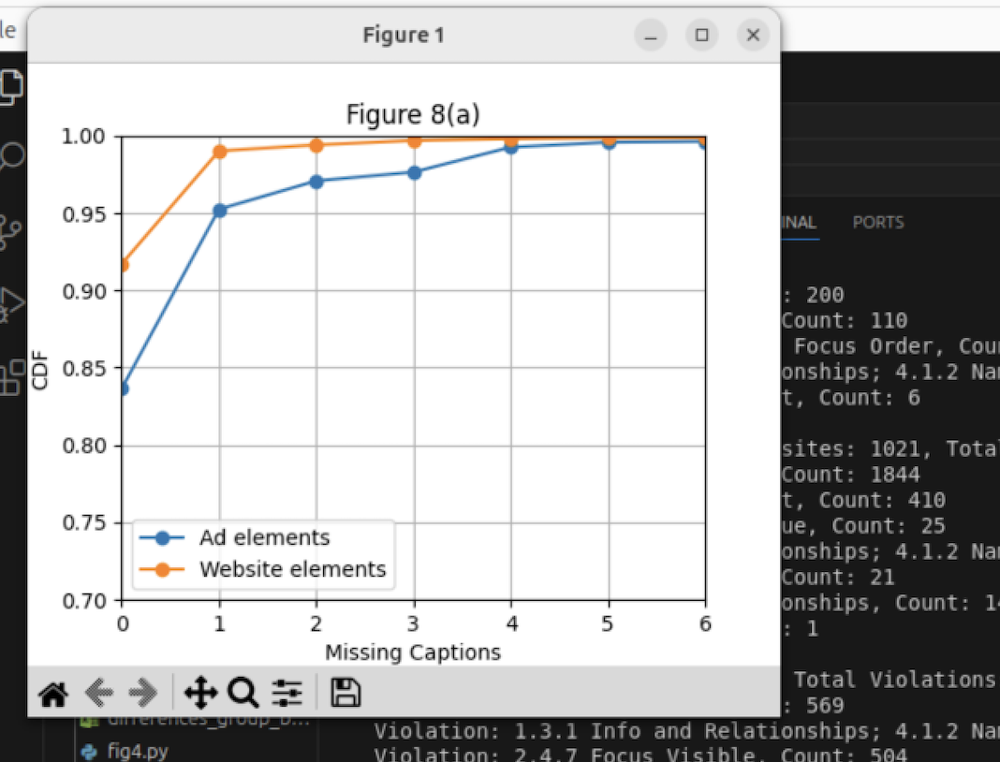
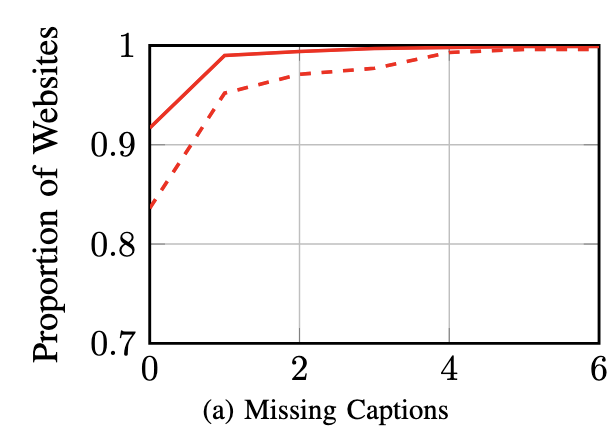

##### Figure 8b:

- **Time Required**: This step takes approximately 2-4 minutes to complete.  
- **Output**: The figure will appear in a pop-up window once processing is complete.  

> You can close the figure to proceed to the next step. 

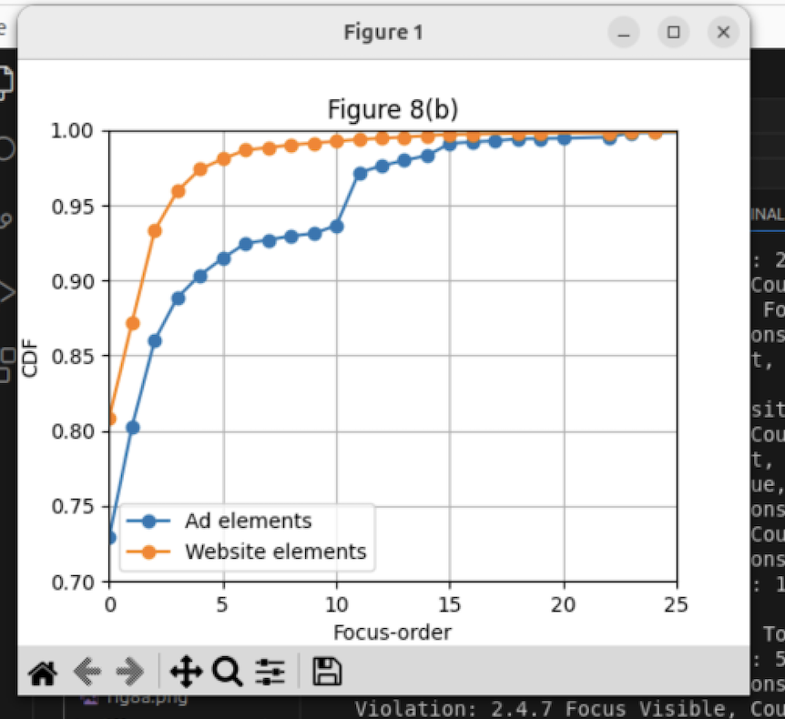
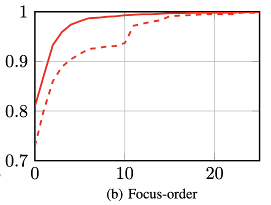

##### Figure 8c:

- **Time Required**: This step takes approximately 2-4 minutes to complete.  
- **Output**: The figure will appear in a pop-up window once processing is complete.  

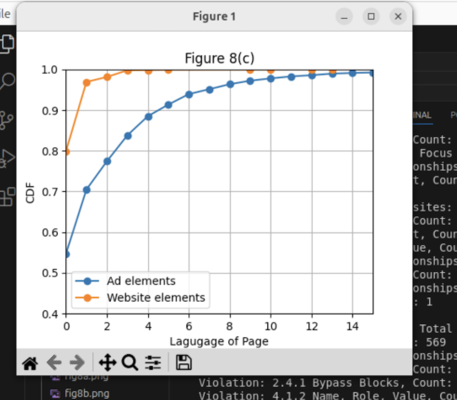
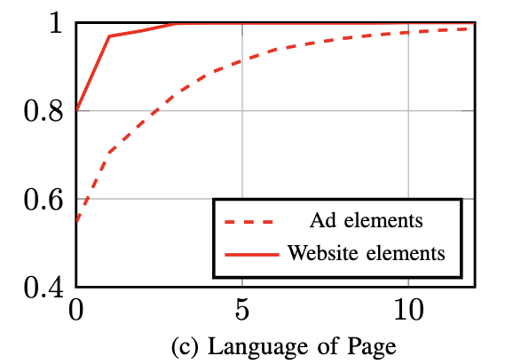

---
## Artifact Support

contact: hadiamjad@vt.edu
