# Accessibility Issues in Ad Driven Web Applications

---

**Abdul Haddi Amjad** , Muhammad Danish, Bless Jah, Muhammad Ali Gulzar IEEE International Conference on Software Engineering (ICSE) 2025

## Artifact Badge Request:

---

### 1. Available

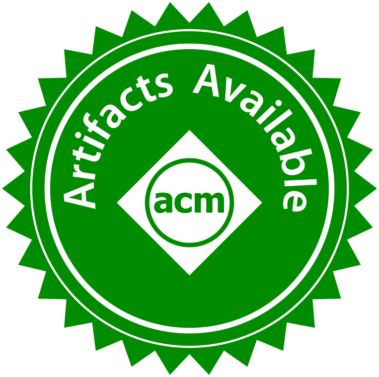

This is a public repository and zenodo link to download Virtual Image (`.ova`) ([https://zenodo.org/records/12775210](https://zenodo.org/records/12775210)), accessible to everyone.

---

### 2. Functional

We have created a Virtual Image (`.ova`) to implement the methodology described in the paper. This allows you to specify a website to be crawled both with and without ads, generate accessibility reports for each instance, and extract ad-specific accessibility violations.

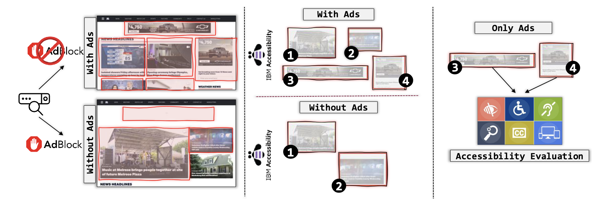

#### Steps:

> **Ensure you follow the next steps on either a Mac (Intel) or Windows system.**

1. Install VM Ware Fusion Using these steps: [https://services.tctc.edu/TDClient/323/InfoTech/KB/ArticleDet?ID=21304]()
2. Install VM Image(`.ova`) from this link:
3. Now open VM Ware Fusion and click `File` on the top left corner and from dropdown choose `import` (mac):
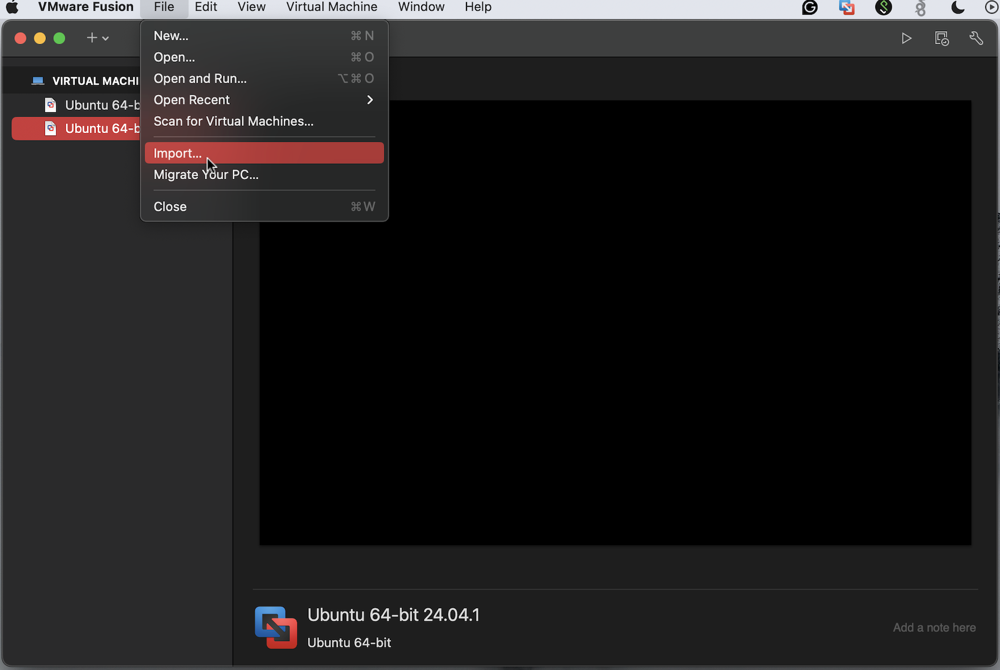
4. Click `choose file` and browse to (`.ova`) file you have downloaded in previous step:
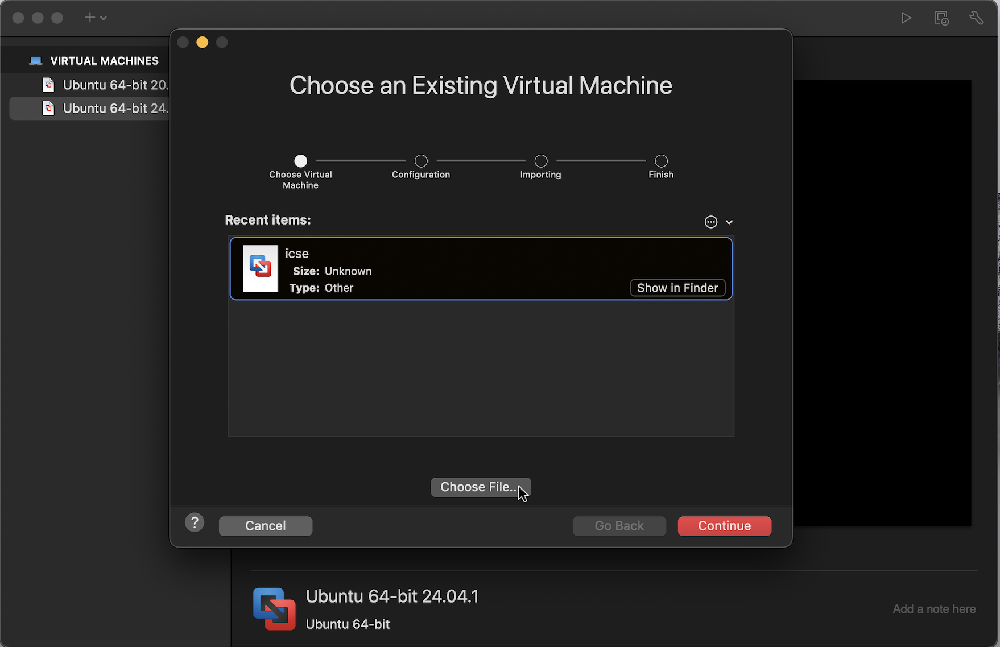
5. You can name as `icse` and click `save`:
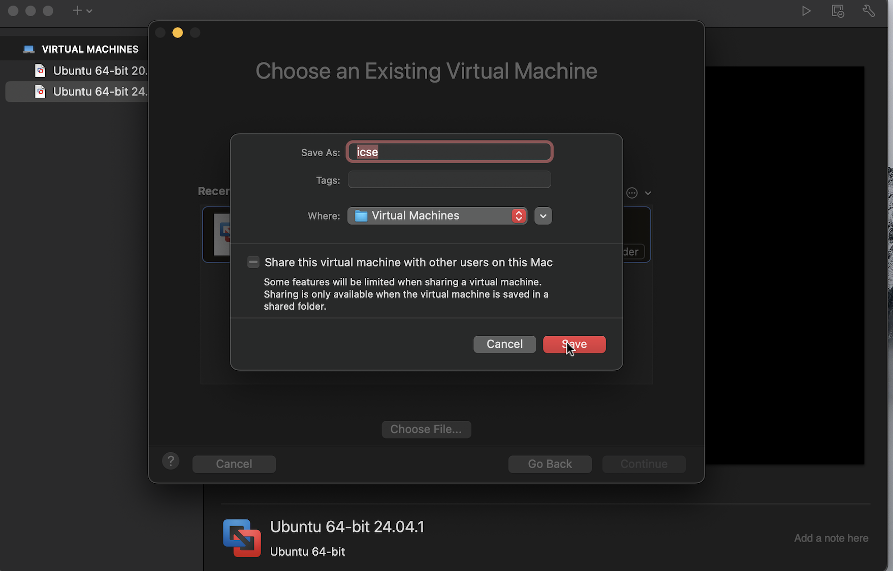
6. Now it will start importing the Virtual Machine (this step take couple of minutes):
> Note as specified earlier, it will give error if resources are not sufficient on the machine.
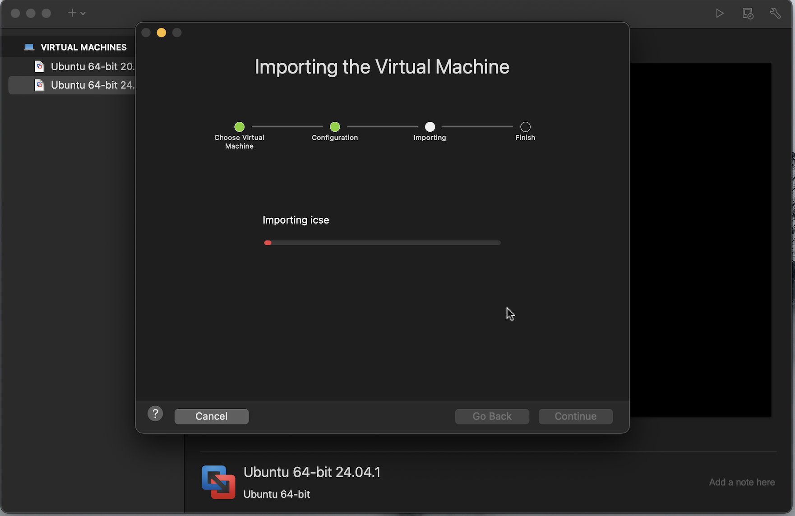
7. Once import is done, click `ok` on this pop-up:
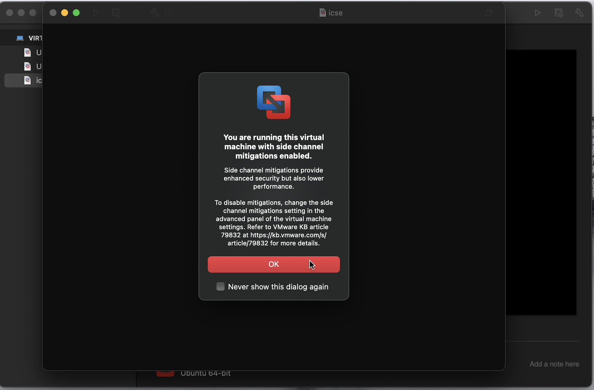
8. If you see this pop-up, then just enter `0000` (four time zero digit) as a code:
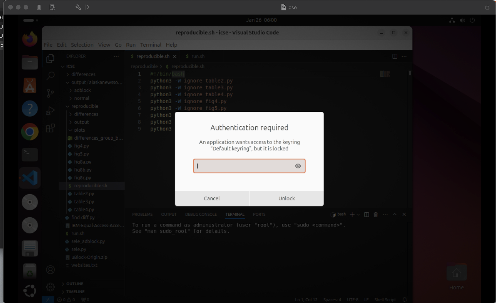
9. Open VS code from side dock.
10. Open Folder, present in `Downloads/icse`:
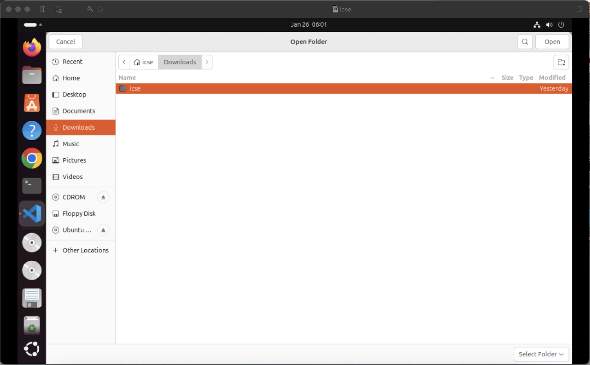
11. Open the terminal and activate the conda environment `conda activate icse`:
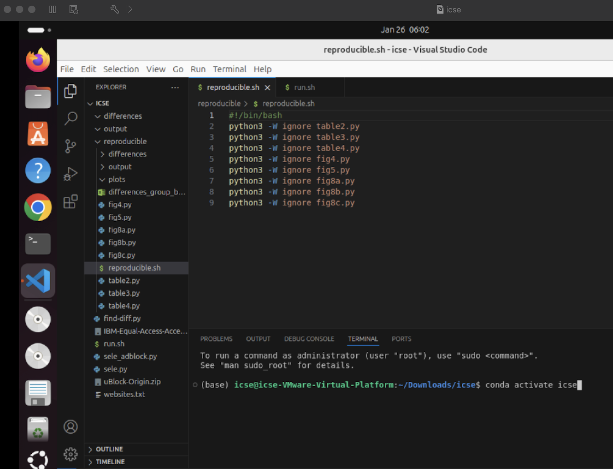
12. Now run `bash run.sh`:
> This step uses selenium-automation to automatically open and perform following operations and it will take around ~15mins to complete
 - This will first crawl website specified in `websites.txt` (in this case we are crawling alaskanewssource.com) WITH ADS
 - Then it will crawl crawl website specified in `websites.txt` (in this case we are crawling alaskanewssource.com) WITHOUT ADS
 - Extract ADS-specific violations
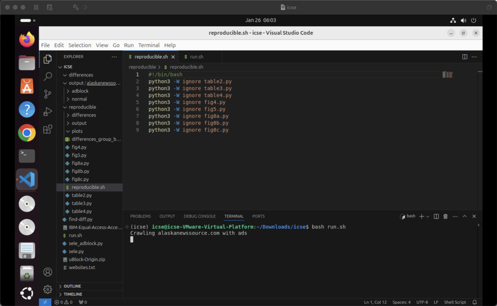
13. After successfull run, you will see the following output on terminal:
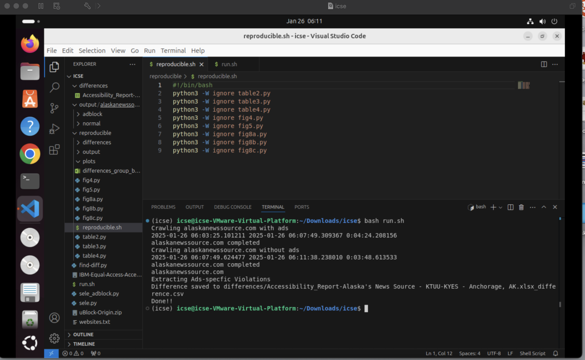
> difference folder on the left panel has the ads-specific violations saved in `.csv` format. 

This completes our three-step methodology as specified in the paper

---

